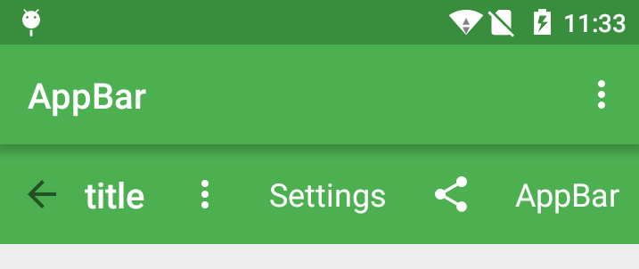
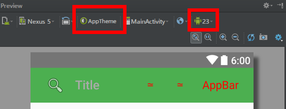

# AppBar
[](https://jitpack.io/#tianzhijiexian/AppBar)  

通过继承ToolBar而实现的灵活、简单AppBar，纯净原生。

---

更改原生ActionBar样式需要定义各种style，这些style真的太难理解了（我花了三天才理解）。ActionBar内部的view还都是不能直接拿到的，很不灵活。  
我不希望自己写一个导航栏，我希望利用原生控件来满足丰富的定制需求，于是我通过继承ToolBar的方式来做了ActionBar。  

### 示例   



```java
<kale.ui.view.AppBar
	android:id="@+id/app_bar"
	android:layout_width="match_parent"
	android:layout_height="?attr/actionBarSize"

	app:menu1="@string/icon_settings" // text menu
	app:menu2="@drawable/icon_publish" // icon menu
	app:menu3="@layout/menu_view_layout" // custom menu
	app:navigationGravity="top"
	app:title="Title" // title
	/>
```

   

### 添加依赖

1.在项目外层的build.gradle中添加JitPack仓库

```  
repositories {
	maven {
		url "https://jitpack.io"
	}
}
```    
2.在用到的项目中添加依赖

compile 'com.github.tianzhijiexian:AppBar:[Last Version](https://github.com/tianzhijiexian/AppBar/releases)' (<-click it)   

### 使用方式    

**0. 混淆配置**   
> -keep class android.support.v7.widget.Toolbar {*;}

**1. 在主题中设置默认样式（一次设置就搞定）**
```XML   
	<!-- Base application theme. -->
    <style name="AppTheme" parent="Theme.AppCompat.Light.DarkActionBar">
        <!-- Customize your theme here. -->

	<!-- 支持toolbar -->
        <item name="windowActionBar">false</item>
        <item name="android:windowNoTitle">true</item>
        <item name="windowNoTitle">true</item>

        <!-- 默认是toolbar的背景色（也可以去toolbarStyle中配置android:background） -->
        <item name="colorPrimary">@color/color_primary_green</item>
        <!-- 默认是toolbar的title颜色（也可以去toolbarStyle中配置titleTextAppearance） -->
        <item name="android:textColorPrimary">@android:color/darker_gray</item>
        <!-- toolbar的样式 -->
        <item name="toolbarStyle">@style/Toolbar</item>
        <!-- toolbar上的menu整体样式 -->
        <item name="toolbarNavigationButtonStyle">@style/Toolbar.Menu</item>
        <!-- toolbar上的menu的样式 -->
        <item name="toolbarMenuTextStyle">@style/Toolbar.Menu.Text</item>
        <item name="toolbarMenuImageStyle">@style/Toolbar.Menu.Image</item>
    </style>
```  
这里的style都是采用的系统默认style，你完全可以自己参考默认style进行定义。属性详解：
https://github.com/tianzhijiexian/AppBar/blob/master/app/src/main/res/values/styles.xml

**2. 布局文件**  
```XML  
<kale.ui.view.AppBar
	android:layout_width="match_parent"
	android:layout_height="?attr/actionBarSize"

	app:navigationIcon="@drawable/abc_ic_menu_moreoverflow_mtrl_alpha"
	app:title="@string/title"
	app:menu1="@string/app_name"
	app:menu2="@drawable/abc_ic_menu_share_mtrl_alpha"
	app:menu3="@string/action_settings"
	app:menu4="@drawable/abc_ab_share_pack_mtrl_alpha"
	app:menu5="@drawable/abc_dialog_material_background_dark"
	/>
```  

**3. java代码**   

```JAVA  
AppBar appBar = (AppBar) findViewById(R.id.app_bar);

appBar.getMenu01(); // 可以通过appbar来获得menu对象
appBar.getTitleView();
appBar.getNavButton();
appBar.getSubtitleView();
appBar.getLogoView();
appBar.getCollapseButton();
appBar.canFinishActivity(); // 调用此方法后，点击toolbar左边按钮会让activity finish
// 还有各种toolbar本身的方法……

View customMenu = appBar.getMenu03();
((TextView) customMenu.findViewById(R.id.menu_tv)).setText("kale");
```  

**4.其他**   

如果你出现无法预览的情况，请设置好自己的主题：



附上android源码中toolbar的全部attr，以便于进行更加详细的设定：  
```XML
    <declare-styleable name="ToolBar">
        <attr name="titleTextAppearance" />
        <attr name="subtitleTextAppearance" />
        <attr name="title" />
        <attr name="subtitle" />
        <attr name="android:gravity" />
        <attr name="titleMargins" />
        <attr name="titleMarginStart" />
        <attr name="titleMarginEnd" />
        <attr name="titleMarginTop" />
        <attr name="titleMarginBottom" />
        <attr name="contentInsetStart" />
        <attr name="contentInsetEnd" />
        <attr name="contentInsetLeft" />
        <attr name="contentInsetRight" />
        <attr name="maxButtonHeight" />
        <attr name="collapseIcon" />
        <attr name="collapseContentDescription" />
        <attr name="popupTheme" />
        <attr name="navigationIcon" />
        <attr name="navigationContentDescription" />
        <attr name="android:minHeight" />
    </declare-styleable>  
```   

### 感悟  

**为什么ActionBar不是放在xml中，而是要在Activity来设置呢？**  

 因为ActionBar会复用在很多页面，如果做成单个的控件，那么几乎每个页面都需要放置这样一个view，不够统一。早期android的设计是希望ActionBar的样式全局唯一，Activity仅需要对ActionBar做差异性处理即可，这个设计不无道理。但因为ActionBar样式的不灵活和诸多原因，官方推出了ToolBar。

**为什么ActionBar的menu要放在一个独立的xml中写？**  

   之前的设计方案是把ActionBar整体的样式用style来定义，ActionBar的具体事件在Activity中实现，但不希望Activity自身做太多view相关的操作，同时为了方便静态预览（xml），就建立了一个menu的目录来存放不同页面menu的xml配置。这是变和不变隔离的思想，但解耦必然会产生文件的增多，想要写一个ActionBar我们需要一个menu的xml文件，然后在activity中进行create和处理按钮事件，不够方便。  

### 开发者


Jack Tony: <developer_kale@foxmail.com>  


### License

    Copyright 2016-2019 Jack Tony

    Licensed under the Apache License, Version 2.0 (the "License");
    you may not use this file except in compliance with the License.
    You may obtain a copy of the License at

       http://www.apache.org/licenses/LICENSE-2.0

    Unless required by applicable law or agreed to in writing, software
    distributed under the License is distributed on an "AS IS" BASIS,
    WITHOUT WARRANTIES OR CONDITIONS OF ANY KIND, either express or implied.
    See the License for the specific language governing permissions and
    limitations under the License.
